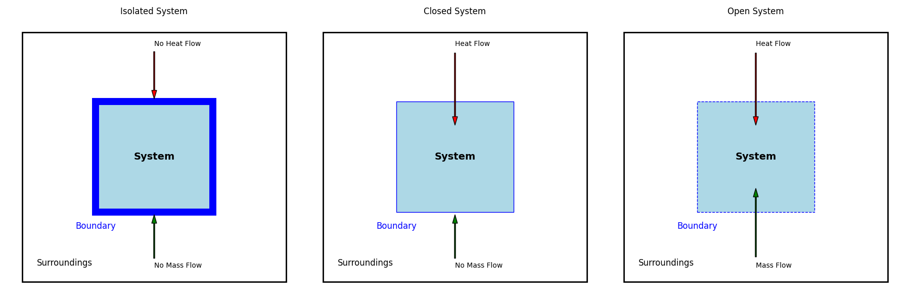

---
jupytext:
  text_representation:
    extension: .md
    format_name: myst
    format_version: 0.13
    jupytext_version: 1.16.4
kernelspec:
  display_name: comp-prob-solv
  language: python
  name: python3
---

# Chapter 9: Classical Thermodynamics

## Learning Objectives

By the end of this lecture, you should be able to

1. Set up a thermodynamic system and its associated variables.
2. Understand qualitatively the laws of thermodynamics.
3. Appreciate the role of free energy in establishing equilibrium.

## Why Should You Care About Thermodynamics?

Will two molecules react? If so, how much heat will they give off? How far will the reaction proceed? Will precipitation bring rain or snow? These and many other questions are central to our lived experience in the chemical sciences and, more broadly, in the natural world. The answers to these questions are governed by the laws of thermodynamics.

## Thermodynamic Systems

Before we discuss the laws of thermodynamics, which will give greater insight into the etymology of the word "thermodynamics," we should define a **thermodynamic system**.


````{margin}
```{note}
A useful list of thermodynamic properties can be found here: [https://en.wikipedia.org/wiki/List_of_thermodynamic_properties](https://en.wikipedia.org/wiki/List_of_thermodynamic_properties).
```
````

As shown above, a thermodynamic system consists of three parts: the **system**, its **surroundings**, and the **boundary** separating them. The **state** of the system is defined by the values of its **state variables**, which include pressure $P$, volume $V$, number of moles $n$ or number of particles $N$ (where "particles" can refer to atoms, molecules, ions, clusters, *etc.*), and temperature $T$. There are two types of state variables: **extensive** and **intensive**. Extensive variables, like $V$ and $n$, depend on the size of the system, while intensive variables, like $P$ and $T$, do not. The **equation of state** relates the state variables of a system. For an **ideal gas**, the equation of state is the ideal gas law, $PV = nRT$.

There are three main types of systems that differ in the boundary between them and their surroundings: **isolated**, **closed**, and **open** systems.



Isolated systems have boundaries that are impermeable to matter and energy. Closed systems have boundaries that are impermeable to matter but not energy. Open systems have boundaries that are permeable to both matter and energy.

## The Laws of Thermodynamics

### The Zeroth Law

The **zeroth law of thermodynamics** states that if two systems are in thermal equilibrium with a third system, then they are in thermal equilibrium with each other.


### The First Law

#### Internal Energy, Work, and Heat

````{margin}
```{note}
Internal energy is a **state function**, meaning that its value depends only on the state of the system and not on how the system arrived at that state. It has an exact differential, $dU$.
```
````

**Internal energy** $U$ is the sum of the kinetic and potential energies of the particles in a system. For classical particles, the internal energy is given by

$$U = \sum_i \frac{1}{2} m_i v_i^2 + V \left( \{ r_i \} \right)$$

where $m_i$ is the mass of particle $i$, $v_i$ is its velocity, and $V$ is the potential energy of the particles. For example, in the case of two particles interacting via a spring, $V = \frac{1}{2} k \left( r - r_0 \right)^2$, where $k$ is the spring constant, $r$ is the distance between the particles, and $r_0$ is the distance between the particles that corresponds to the minimum potential energy.


The internal energy of this system is

$$U = \frac{1}{2} m_1 v_1^2 + \frac{1}{2} m_2 v_2^2 + \frac{1}{2} k \left( r - r_0 \right)^2$$

````{margin}
```{note}
Work and heat are **path functions**, meaning that their values depend on the path taken to reach a particular state. They have inexact differentials, $\delta w$ and $\delta q$.
```
````

The **work** $w$ done on a system is the energy transferred to the system by a force acting on it. The work done by a force $\mathbf{F}$ on a system is

$$w = \int \mathbf{F} \cdot d\mathbf{r}$$

where $\mathbf{r}$ is the position vector of the system. The work done by a force on a system is positive if the force is in the same direction as the displacement of the system and negative if the force is in the opposite direction. For example, the work done by a gas expanding against a piston is

$$w = -\int P dV$$

where $P$ is the pressure of the gas and $V$ is the volume of the gas.

The **heat** $q$ transferred to a system is the energy transferred to the system by a temperature difference. The heat transferred to a system is positive if the system gains energy and negative if the system loses energy.

#### Statement of the First Law

The **first law of thermodynamics** states that the change in internal energy of a system is equal to the heat added to the system plus the work done on the system

$$\Delta U = q + w$$

For infinitesimal changes in internal energy, heat, and work, the first law can be written as

$$dU = \delta q + \delta w$$

### The Second Law

````{margin}
```{note}
Entropy is a **state function**, meaning that its value depends only on the state of the system and not on how the system arrived at that state. It has an exact differential, $dS$.
```
````

````{margin}
```{note}
A **reversible** process is a **quasistatic** process that can be reversed without net changes (*e.g.*, in entropy) in the system or its surroundings. A **quasistatic** process is a process that proceeds through a series of equilibrium states.
```
````

The **second law of thermodynamics** states that the entropy of an isolated system never decreases. The entropy of a system is a measure of the number of ways the system can be arranged. The second law can be stated in many ways, including

$$\Delta S \geq \frac{q}{T}$$

where $\Delta S$ is the change in entropy of the system, $q$ is the heat added to the system, and $T$ is the temperature of the system. For infinitesimal changes in entropy and heat, the second law can be written as

$$dS \geq \frac{\delta q}{T}$$

The equality holds for **reversible** processes, while the inequality holds for **irreversible** processes.

#### Fundamental Thermodynamic Relation

By combining the first and second laws of thermodynamics, we can derive the **fundamental thermodynamic relation** for a reversible process

$$dU = T dS + \delta w$$

For mechanical work, the fundamental thermodynamic relation becomes $dU = T dS - P dV$.

### The Third Law

````{margin}
```{note}
A **perfect crystal** is a crystal in which all atoms are in a perfect, ordered arrangement.
```
````

The **third law of thermodynamics** states that the entropy of a perfect crystal at absolute zero is zero.

## Thermodynamic Potentials

| Potential | Definition | Equation |
|-----------|------------|----------|
| Internal energy | Sum of kinetic and potential energies of particles | $U = \sum_i \frac{1}{2} m_i v_i^2 + V \left( \{ r_i \} \right)$ |
| Enthalpy | Internal energy plus pressure-volume work | $H = U + PV$ |
| Helmholtz free energy | Energy available to do work at constant volume | $A = U - TS$ |
| Gibbs free energy | Energy available to do work at constant pressure | $G = U + PV - TS$ |

### Equilibrium

A system is in **equilibrium** when its relevant thermodynamic potential is minimized. For a system at constant temperature and volume, the equilibrium condition is $dA = 0$. For a system at constant temperature and pressure, the equilibrium condition is $dG = 0$.

#### Phase Equilibria

A **phase** is a region of space in which the properties of a material are uniform. A **phase transition** is a change in the properties of a material as it moves from one phase to another. The **phase diagram** of a material shows the regions of space in which the material is in a particular phase.


The figure above shows the $P$-$T$ phase diagram of carbon dioxide. The **phase boundary** between two phases is the line at which the free energies of the two phases are equal. The **triple point** is the point at which the free energies of all three phases are equal.

## Summary

In this lecture, we have introduced the concept of a thermodynamic system and its associated variables. We have discussed the laws of thermodynamics and their implications for the behavior of systems. We have also introduced the concept of thermodynamic potentials and their role in establishing equilibrium. Finally, we have discussed phase equilibria and the phase diagram of a material.
