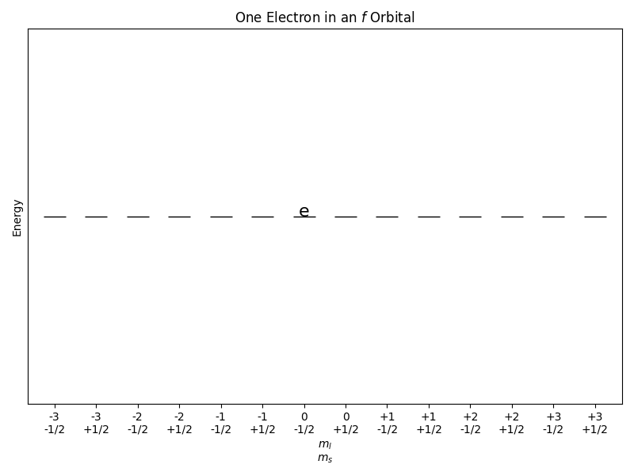
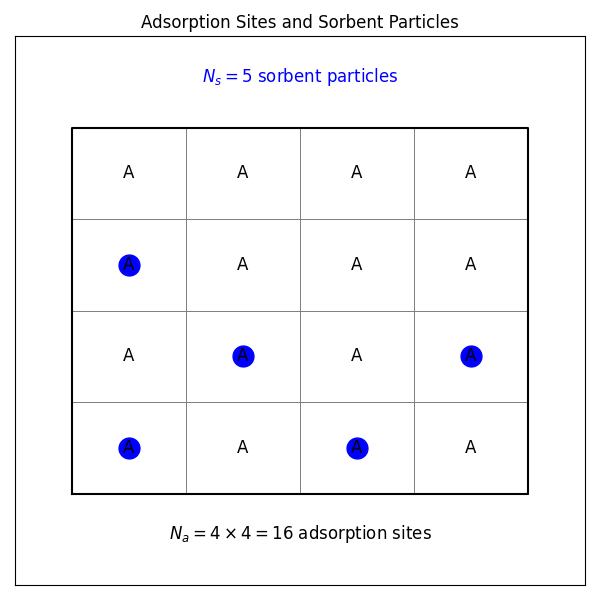

---
jupytext:
  text_representation:
    extension: .md
    format_name: myst
    format_version: 0.13
    jupytext_version: 1.16.4
kernelspec:
  display_name: comp-prob-solv
  language: python
  name: python3
---

# Chapter 11: Ensembles and Ergodicity

## Learning Objectives

By the end of this lecture, you should be able to

1. Define the microcanonical, canonical, isothermal-isobaric, and grand canonical ensembles.
2. Understand the concept of ergodicity and its implications for the relationship between ensemble averages and time averages.

## Why Should You Care About Ensembles?

In the previous lecture, we discussed the concept of a microstate and how it can be used to describe the state of a system. However, in many cases, we are not interested in the properties of individual microstates but rather in the average behavior of a system over many microstates. This is where the concept of an ensemble comes in.

An ensemble is a collection of systems that are identical in all respects except for the particular microstate they occupy. By studying the properties of an ensemble, we can make predictions about the behavior of a system without having to consider every possible microstate individually.

## Types of Ensembles

There are several different types of ensembles that are commonly used in statistical mechanics. The choice of ensemble depends on the conditions under which the system is being studied. Each of these ensembles has its own set of constraints and corresponding thermodynamic potentials that can be used to describe the behavior of the system.

### Microcanonical Ensemble

In this ensemble, the system is isolated and has fixed values of energy, volume, and number of particles. The microcanonical ensemble is used to study systems that are closed and do not exchange energy or particles with their surroundings.

#### Microcanonical Ensemble: Example



Consider a system of one electron in an f orbital. The energy of the electron is quantized, and the electron can occupy one of the 14 f orbitals. The microcanonical ensemble for this system would consist of all possible configurations of the electron in the f orbitals that have the same total energy. The **equal a priori probability postulate** states that all microstates with the same energy are equally likely to occur. Therefore, the probability of finding the electron in any particular f orbital is the same, *i.e.*, 1/14.

### Canonical Ensemble

In this ensemble, the system is in thermal contact with a heat bath at a fixed temperature. The canonical ensemble is used to study systems that are in thermal equilibrium with their surroundings.

### Isothermal-Isobaric Ensemble

In this ensemble, the system is in thermal and mechanical equilibrium with a heat bath at a fixed temperature and pressure. The isothermal-isobaric ensemble is used to study systems that are in thermal and mechanical equilibrium with their surroundings.

#### Isothermal-Isobaric Ensemble: Example

Consider a gas confined to a container with a movable piston. The gas is in thermal equilibrium with a heat bath at a fixed temperature and pressure. The isothermal-isobaric ensemble for this system would consist of all possible configurations of the gas molecules that have the same number of particles, pressure, and temperature.

### Grand Canonical Ensemble

In this ensemble, the system is in thermal and chemical equilibrium with a heat bath at a fixed temperature and chemical potential. The grand canonical ensemble is used to study systems that are in thermal and chemical equilibrium with their surroundings.

#### Grand Canonical Ensemble: Example

````{margin}
```{note}
The chemical potential is a measure of the energy required to add a particle to a system.
```
````

Consider a model system with sorbent particles that interact with adsorption sites on a solid surface but do not interact with each other.



For one adsorption site, there are two possible states: empty or occupied. Therefore, the partition function for the system is given by

$$
Z = \sum_{N=0}^{1} e^{\beta \mu N}
$$

where $\mu$ is the chemical potential. Since the sorbent particles do not interact with each other, the ensemble average of the coverage of the surface by the sorbent particles $\theta$ is given by the ensemble average of the number of particles at each adsorption site, which is

$$
\theta = \langle N \rangle = \frac{\partial \ln Z}{\partial \left( \beta \mu \right)} = \frac{e^{\beta \mu}}{1 + e^{\beta \mu}}
$$

If the sorbent particles are in equilibrium with their ideal gas phase, the chemical potential is given by

$$
\mu = \mu^{\circ} + k_B T \ln \left( \frac{P}{P^{\circ}} \right)
$$

where $\mu^{\circ}$ is the standard chemical potential, $P$ is the pressure of the ideal gas phase, and $P^{\circ}$ is the standard pressure. The coverage of the surface by the sorbent particles can then be calculated as a function of the pressure of the ideal gas phase.

$$
\theta = \frac{e^{\beta \mu^{\circ}} \left( \frac{P}{P^{\circ}} \right)}{1 + e^{\beta \mu^{\circ}} \left( \frac{P}{P^{\circ}} \right)} = \frac{K P}{1 + K P}
$$

where $K = e^{\beta \mu^{\circ}} / P^{\circ}$. This equation describes the Langmuir adsorption isotherm, which is commonly used to describe the adsorption of gases on solid surfaces.


The plot above shows the coverage of the surface by the sorbent particles as a function of the pressure of the ideal gas phase. As the pressure increases, the coverage of the surface also increases, but it reaches a maximum value at high pressures.

## Ergodicity

The concept of ergodicity is central to the relationship between ensemble averages and time averages in statistical mechanics. A system is said to be ergodic if it explores all of its microstates over time. In an ergodic system, the time average of a property is equal to the ensemble average of that property.

### Implications of Ergodicity

If a system is ergodic, then the ensemble average of a property can be calculated by averaging the property over time. This means that we can use time averages to make predictions about the behavior of a system without having to consider every possible microstate individually.

### Non-Ergodic Systems

Not all systems are ergodic. In non-ergodic systems, the time average of a property may not be equal to the ensemble average of that property. In such cases, it may be necessary to consider the properties of individual microstates to make accurate predictions about the behavior of the system. Non-ergodic systems are often more difficult to study than ergodic systems because they require a more detailed understanding of the properties of individual microstates. However, many real-world systems are non-ergodic, and understanding their behavior is an important area of research in statistical mechanics.

## Summary

In this lecture, we discussed the concept of ensembles and how they can be used to study the average behavior of a system over many microstates. We also introduced the concept of ergodicity and its implications for the relationship between ensemble averages and time averages. By understanding these concepts, we can make predictions about the behavior of complex systems without having to consider every possible microstate individually.

```{admonition} What's Next?
:class: tip
Now, we're ready to take the next step: developing our own simulation codes to explore the behavior of systems using Monte Carlo and molecular dynamics techniques.
```
